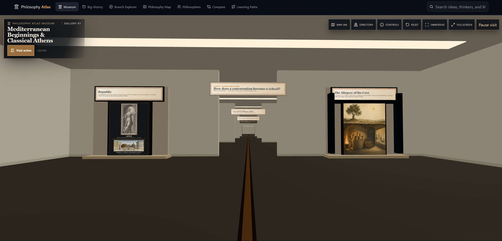
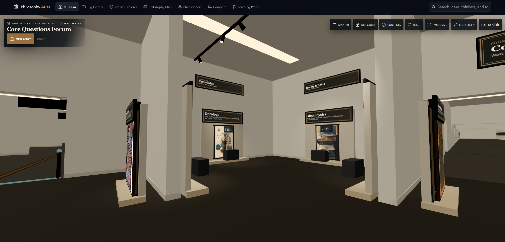

# Philosophy Atlas

**A free, walkable museum and interactive atlas of philosophy as a connected history of ideas.**

[Enter the live Museum](https://da3daluscode.github.io/philosophy-museum/) · [Open Big History](https://da3daluscode.github.io/philosophy-museum/#/history) · [About & editorial method](https://da3daluscode.github.io/philosophy-museum/#/methodology)

Current release: **[v1.0.2](https://github.com/Da3dalusCode/philosophy-museum/releases/tag/v1.0.2)**



## What Philosophy Atlas is

Philosophy Atlas is a browser-based educational project that welcomes visitors through a walkable Museum, then opens into timelines, maps, articles, comparisons, and learning paths showing how philosophical questions, schools, thinkers, works, and disagreements develop across time and cultures. It presents philosophy as an evolving conversation rather than a list of isolated biographies.

The Museum is the default public entrance; every other Atlas tool remains directly available. The project is static and local-first: there is no account, backend, advertising, subscription, or paid service requirement.

## Highlights

- **192 canonical full articles:** 147 philosopher profiles and 45 records covering philosophies, branches, schools, traditions, movements, methods, and frameworks.
- **Walkable Museum:** the default visitor entrance, with 26 curated/open galleries and 105 rooms on one connected public level, guided travel, and a complete directory for visitors who prefer not to use free movement.
- **[Big History](https://da3daluscode.github.io/philosophy-museum/#/history):** a filterable chronology connecting thinkers, traditions, works, and major historical developments.
- **[Branch Explorer](https://da3daluscode.github.io/philosophy-museum/#/branches) and [Philosophy Map](https://da3daluscode.github.io/philosophy-museum/#/map):** complementary ways to follow concepts, disagreements, inheritance, opposition, and transformation.
- **[Philosopher profiles](https://da3daluscode.github.io/philosophy-museum/#/philosophers), [Compare](https://da3daluscode.github.io/philosophy-museum/#/compare), and [Learning Paths](https://da3daluscode.github.io/philosophy-museum/#/paths):** focused reading, side-by-side study, and guided routes through major questions and periods.
- **Global search:** coverage across philosophers, traditions, Museum galleries, and individual exhibits.

## Editorial depth and sourcing

Every one of the 192 canonical full articles meets the universal minimum of 2,000 substantive words. The release gate enforces that floor for all 147 philosopher articles and all 45 philosophy, branch, school, tradition, movement, method, and framework articles. The [generated depth inventory](docs/editorial/article-depth-inventory.md) records the method and per-article results.

Depth is not the same as evidence or completed editorial review. The [generated editorial coverage report](docs/editorial/editorial-coverage-report.md), [primary exhibit-review ledger](docs/editorial/exhibit-review-ledger.md), and [supplemental exhibit-review ledger](docs/editorial/supplemental-exhibit-review-ledger.md) record the current states.

<!-- public-collection-counts:start -->
The current generated reports record **192 of 192 canonical articles as currently claim-reviewed**—147 philosopher profiles and 45 articles on philosophies, branches, schools, traditions, movements, methods, and frameworks—and **192 of 192 primary Museum exhibits as standard-compliant**. Article depth, claim review, and primary exhibit review remain separate milestones; completing one does not confer another.

The Museum also contains **411 supplemental/context exhibits**: **282 reviewed supplementals** and **129 explicit backlog supplementals**. Together, the 192 primary and 411 supplemental exhibits make **603 interpreted Museum stops**.
<!-- public-collection-counts:end -->

These are internal, AI-assisted editorial review states; they are not independent fact-checking or independent academic or peer review. The in-app [About & editorial method](https://da3daluscode.github.io/philosophy-museum/#/methodology) and repository [editorial model](docs/editorial/editorial-model.md) explain these states and their limits.

## Walkable Museum

The Museum turns the Atlas into a physical journey through 26 curated/open galleries and 105 named rooms or zones. Its 192 primary and 411 supplemental/context exhibits form the 603 interpreted stops inventoried above.



Public Gallery 01–26 numbering follows the chronological visitor route. A continuous flush route inlay runs from the Grand Entrance through every gallery to the Final Return and exit; quieter branches mark the central crosscut and shortcuts. The Museum Map is generated from the same compiled building manifest, tracks the visitor's position and facing, and supports fast travel across the complete public route.

Visitors can walk freely, follow guided travel between safe viewpoints, or use the accessible directory to open every exhibit and its related Atlas article. Stable direct exhibit routes make individual installations linkable without requiring a full Museum traversal. The [Museum masterplan](docs/museum-masterplan/README.md), [building plan](docs/museum-masterplan/single-level-building-plan.md), and [media provenance record](docs/museum-asset-provenance.md) document the current program, route, and rights metadata.

## Controls

- Choose **Begin Museum Visit**, then use **W A S D** or the arrow keys to move.
- Choose **Standard** or **Fast** as the preferred pace; hold **Shift** for temporary Fast movement on desktop.
- Press **Space** to jump.
- Press **Ctrl** or **C** while moving to slide. Jump during a slide to cancel it into a brief airborne momentum boost.
- Press **E** or **Enter** near an exhibit or the Museum Map to interact.
- Press **M** for the Museum Map and **R** to reset to the Grand Entrance.
- Press **Escape** to release mouse capture; in drag-look mode it pauses the visit.
- Press **F** for browser fullscreen when no panel is open and fullscreen is available.
- On touch devices, use the separate movement and look controls plus Standard/Fast, Jump, Slide, and contextual Interact actions.

Guided travel and the complete directory remain available without keyboard-and-mouse free movement or WebGL navigation.

## Running locally

Use Node.js 22 and npm, matching the production workflow:

```bash
npm ci
npm run dev
```

Open the URL printed by Vite, normally `http://localhost:5173/philosophy-museum/`.

Create and inspect a production build with:

```bash
npm run build
npm run preview
```

## Validation and deployment

The production site is deployed through [GitHub Pages](https://da3daluscode.github.io/philosophy-museum/) when `main` is updated. The [deployment workflow](.github/workflows/deploy.yml) installs the locked dependencies with Node.js 22, verifies generated manifests, runs the full content and Museum gate, builds the site, enforces bundle budgets, and deploys only after every check passes.

The current release gate includes:

```bash
npm run check:museum-building
npm run check:route-manifest
npm run test:release-gates
npm run validate:museum-masterplan
npm run validate:museum-building-plan
npm run audit:routing
npm run audit:learning-experiences
node scripts/auditMuseum.mjs
npm run audit:museum-plaques
npm run audit:exhibits
npm run audit:museum-mobile-controls
npm run audit:museum-assets
npm run audit:articles
npm run audit:articles:reviewed
npm run audit:editorial
npm run test:editorial
npm run check:public-counts
npm run audit:accuracy
npm run audit:integrity
npm run build
npm run report:bundle
```

The universal article-depth audit is a blocking release gate. It currently passes all 192 canonical full articles; it is not an advisory check and no longer represents a migration backlog.

## Project status

**Philosophy Atlas v1.0.2 is the current published release.** The long-form Atlas, timelines, maps, comparisons, learning paths, search, and complete 26-gallery Museum are published and usable without an account.

The editorial program remains active even though the current canonical article and primary exhibit review passes are complete. Ongoing work includes the supplemental-exhibit backlog, stale-lock maintenance, corrections, relationship enrichment, and targeted accessibility and visual refinement. The Philosophy Map remains intentionally selective for readability, and the static local-first application does not provide accounts or durable cross-device progress.

## License and media rights

The site is free to visit. This repository currently has no repository-wide `LICENSE` file and no repository-wide software license, so it should not be described as open-source software.

Museum media retains item-specific source, credit, license, likeness, derivative, and rights metadata. See the [Museum asset provenance record](docs/museum-asset-provenance.md) for the current policy and inventory.
