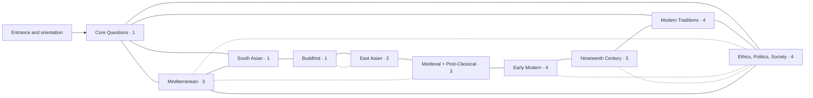
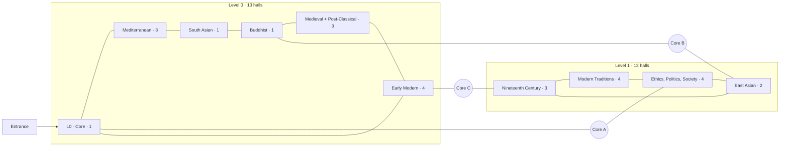
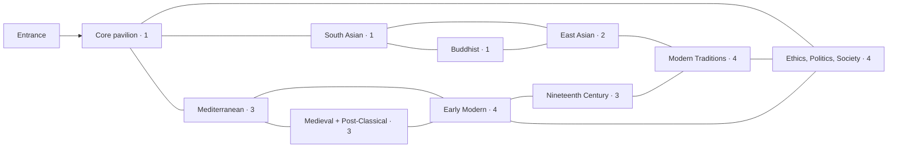

# Physical building decision record

## Approved direction and scope

The **single-level Ring of Wings** is the approved physical basis for the locked **Worlds with a Questions Forum** program: 10 wings, 26 halls, 105 rooms, and 258 record-capacity slots. The ring gives every wing a legible address, gives visitors more than one way home, and can absorb the current six shells without first introducing lifts or a dispersed campus. The Braided Promenade and Pavilion Campus remain archival comparison studies, not active alternatives for the Ring pilot.

This document locks the long-term physical direction but is not itself the runtime geometry specification. The Ring pilot’s authoritative runtime building manifest owns the implemented six-shell placement and connections. Coordinates in [building-manifest.example.json](./building-manifest.example.json) remain an illustrative planning fixture, not construction coordinates or runtime truth.

At the pre-Ring baseline (`39007cf1480900e16cd24bdd8ba1820fd4779a41`), the six-gallery world was a successful prototype but the wrong growth model. It had six halls, eight exhibits and three zones per hall, five hall-to-hall links, approximately 7,312 authored square metres, and approximately 390 metres of primary circulation. Its only public route was a chain. Extending that chain to 26 halls would have increased walking and loading costs while making orientation progressively worse. Its visitor map derived edges from registered connections, but its node percentages were a separately authored topological diagram rather than a projection of physical footprints. The Ring pilot replaces those baseline physical and map assumptions without changing the six public content routes.

The design review required every studied concept to preserve the good runtime contracts—one persistent canvas, hall-local coordinates, collision-backed thresholds, and safe arrival poses—while replacing the chain with loops, short returns, and reserved expansion points. The Ring is the approved result.

## The 26-hall kit of parts

The building options use the same stable hall program. Codes below keep the diagrams readable; IDs remain authoritative.

| Wing | Code and stable hall ID | Template |
| --- | --- | --- |
| Core Questions Forum | `CQ` — `core-questions-forum` | `crossroads-4` |
| Mediterranean Antiquity | `MBC` — `mediterranean-beginnings-classical`; `HRW` — `hellenistic-roman-ways`; `LAI` — `late-antiquity-inheritance` | sequence; crossroads; sequence |
| South Asian Intellectual Worlds | `CSA` — `classical-south-asian-worlds` | `sequence-3` |
| Buddhist Traditions Across Asia | `BP` — `buddhist-philosophies` | `sequence-3` |
| Chinese & East Asian Intellectual Worlds | `CCT` — `classical-chinese-traditions`; `EAC` — `east-asian-continuities` | crossroads; sequence |
| Connected Medieval & Post-Classical Intellectual Worlds | `IPW` — `islamic-philosophical-worlds`; `JPH` — `jewish-philosophy`; `LCS` — `latin-christian-scholastic` | sequence; standard; sequence |
| Early Modern Europe & Enlightenments | `RHN` — `renaissance-humanism-new-method`; `RMNS` — `rationalism-mind-nature-system`; `ESPO` — `empiricism-science-political-order`; `ERK` — `enlightenment-revolution-kant` | sequence; sequence; sequence; crossroads |
| Nineteenth-Century Transformations | `GIA` — `german-idealism-afterlives`; `ULHC` — `utility-liberty-history-capital`; `FPLV` — `faith-pessimism-life-value` | sequence; sequence; sequence |
| Modern Philosophical Traditions | `PDI` — `pragmatism-democratic-inquiry`; `AT` — `analytic-traditions`; `PEE` — `phenomenology-existence-embodiment`; `CPD` — `critique-power-deconstruction` | sequence; sequence; sequence; crossroads |
| Ethics, Politics, and Social Thought | `MLPR` — `moral-life-practical-reason`; `JDR` — `justice-democratic-reason`; `FP` — `feminist-philosophies`; `CRL` — `colonialism-race-liberation` | crossroads; sequence; crossroads; sequence |

In the link counts below, one **link** is one undirected, public hall-to-hall walking connection, counted once. A corridor or vertical core between two halls does not inflate the count; entrance doors, service doors, and inactive reserved portals are excluded. A hall's **degree** is the number of live public hall links it receives.

The SVGs are **conceptual floor-plan diagrams, not scaled construction drawings**. Blocks show wing placement and circulation logic rather than each template-sized hall. The 26 nominal hall footprints total approximately 30,160 m² before corridors, atria, structure, services, and external landscape; compactness and walking claims therefore remain comparative until a scaled site plan is approved.

## Approved template and interface standard

Templates may be rotated or mirrored on a one-metre planning grid. Rotation changes placement, never the meaning of a local doorway slot. Hall-specific partitions may refine a template, but walls, openings, collision, light anchors, safe arrival landings, and map footprints must still resolve from the same physical source.

| Template | Nominal footprint | Intended room count | Doorway slots | Ceiling |
| --- | ---: | ---: | --- | ---: |
| `standard-rect` | 20 × 24 m | 2–3 | `N0`, `S0`, optional `E0`, optional `W0` | 5.8 m |
| `sequence-3` | 24 × 56 m | 3–5 | `N0`, `S0`, optional `E1`, optional `W1` | 5.8 m |
| `crossroads-4` | 28 × 28 m | 4–9 | `N0`, `S0`, `E0`, `W0`, optional `N1`, optional `S1` | 6.2 m |
| `focal-terminal` — rare special case | 20 × 26 m | 1–2 | `N0`, optional `S0` | 6.4 m |

The three normal active templates are `standard-rect`, `sequence-3`, and `crossroads-4`. The focal template is retained only as a rare special-case contract; the current 26-hall program does not use it. It is appropriate for a later terminal work, memorial, or tightly bounded special exhibition and must not become a pretext for giving a tradition only a decorative cul-de-sac. The sequence template's paired side slots are distinct mid-sequence thresholds: neither is presumed open, and each requires its own sightline, landing, and room-partition review before activation.

The declared slot counts have been checked against each concept's maximum demand. In the Ring, `LAI`, `CSA`, `BP`, `EAC`, and `IPW` use three live links plus one blocked reserve; in the Pavilion mesh, `MBC` and `RHN` reach four live links, while `CSA` uses three live links plus a reserve. Those cases consume all four `sequence-3` slots but do not exceed them. A concept may not count a live edge or reserve unless a distinct compatible slot remains at both affected nodes.

Shared dimensions and contracts:

- Walls are 0.36 m thick. Ordinary connectors use a 5.2 m ceiling; standard halls use 5.8 m; crossroads and focal volumes use 6.2–6.4 m.
- Public portals have 4 m clear width, 3.2 m clear height, and a 1.2 m transition depth.
- Primary circulation targets 1.8–2 m clear width. Turning pockets are 1.8 m in diameter.
- Every active portal receives a 4 × 4 m safe landing. The default pose is 2 m inside the threshold and faces the first interpretive landmark.
- Standard exhibit bays are 3 m wide; anchor bays are 4.5 m. Clear viewing floor targets 0.9 × 1.4 m before overlapping circulation is counted.
- Every template exposes the same lighting interfaces: ambient, threshold, perimeter track, anchor track, and accessible-label light.
- Door slots, exhibit slots, colliders, entrance views, and lighting anchors use hall-local coordinates. The physical manifest supplies the world transform and level.
- A reserved slot has a visible blocked threshold and a named reservation, but no runtime connection, no fast-travel destination, and no implication that a hall is already open.

## Archived option comparison

| Concept | Levels | Active links | Degree pattern | Expansion provision | Migration fit |
| --- | ---: | ---: | --- | --- | --- |
| **Ring of Wings — approved** | 1 | 34 | 12 halls degree 2; 12 degree 3; `CQ` and `MLPR` degree 4; average 2.62 | eight outward reserved portals | selected; the six shells can form a truthful pilot loop |
| **Braided Promenade** | 2, 13 halls each | 33 | most halls 2; core-linked gateways 3–4; average 2.54 | six horizontal reserves plus a safeguarded upper-level strategy | weakest near-term; vertical infrastructure is required before the plan is truthful |
| **Pavilion Campus Mesh** | 1 dispersed level | 36 | most halls 2–3; gateways no more than 4; average 2.77 | an outward slot at every pavilion, with several initially reserved | good incremental construction, but long walks and a more complex graph |

## Approved plan — Single-level Ring of Wings

### Floor-plan idea

The entrance and orientation court sits at the south and leads into a central `CQ`. The other 25 halls form one outer loop. Four Forum spokes and five ring-to-ring shortcuts produce 34 active hall links without turning `CQ` into an all-connected supernode. These links are walking routes, not claims that one tradition caused another.

[Open the detailed Ring of Wings diagram](./diagrams/ring-of-wings.svg).

The wing-level Mermaid view shows placement, not every door. The 25-hall outer perimeter is:

`MBC → HRW → LAI → CSA → BP → CCT → EAC → IPW → JPH → LCS → RHN → RMNS → ESPO → ERK → GIA → ULHC → FPLV → PDI → AT → PEE → CPD → MLPR → JDR → FP → CRL → MBC`.

That perimeter supplies 25 links. Four Forum spokes and five shortcuts bring the exact concept total to 34:

| Link family | Hall links | Interpretive purpose |
| --- | --- | --- |
| Four Forum spokes | `CQ–MBC`; `CQ–CSA`; `CQ–AT`; `CQ–MLPR` | offer four legible choices from the comparative center without claiming ownership of the outer histories |
| Transmission and reception | `LAI–IPW`; `BP–EAC` | make translation and transformation visible without folding one tradition into another |
| Practical life and public order | `HRW–MLPR`; `ERK–JDR` | offer a short thematic route across widely separated historical homes |
| Critique, equality, and liberation | `ULHC–FP` | connect nineteenth-century social transformation to feminist genealogy |

`CQ` and `MLPR` have degree four; 12 other gateway halls have degree three; 12 ordinary halls have degree two. The degree sum is 68, or an average of 2.62. No visitor must reverse through a long chain, and a closed loop deliberately has no misleading “journey complete” endpoint.

### Wing placement, loops, and entrance

- **Center and south:** entrance/orientation court and `CQ`, with four clearly labeled spokes to the outer loop.
- **Northwest through north:** Mediterranean, South Asian, Buddhist, and Chinese & East Asian wings. The physical sequence is adjacent, but thresholds explain contemporaneity and difference rather than pretending to one succession.
- **East:** Connected Medieval & Post-Classical and Early Modern wings, with transmission thresholds at `BP–EAC` and `LAI–IPW`.
- **Southeast through south:** Nineteenth-Century Transformations, Modern Traditions, and Ethics, Politics, and Social Thought, returning toward the Mediterranean gateway and `CQ`.

Each multi-hall wing has an internal return choice or a nearby crosscut. Maps appear at the entrance, `CQ`, and every wing gateway. A visitor may follow the perimeter, return through the Forum, or use a named question route. Fast travel remains a separate interface from the depicted walking route.

### Expansion

Eight outward-facing reservations are distributed at `LAI`, `CSA`, `BP`, `EAC`, `IPW`, `LCS`, `PDI`, and `CRL`. They prioritize areas where the current Atlas program explicitly acknowledges continuities or omissions. A reservation records footprint, permitted templates, doorway slot, level, and status. It is not an unnamed hole and does not promise that growth must occur there.

An expansion may extend outward and rejoin the ring at a second reservation; single-ended growth is acceptable only for a genuinely focal program. The central crosscut space remains clear, so new halls do not require moving the entrance or breaking the original perimeter.

### Accessibility and wayfinding

The entire public program is step-free on one level. The ring offers two directions from almost every hall, while crosscuts reduce long returns. Every wing uses a redundant identity of **plain-language name + stable symbol + color**; color is never the only cue. Threshold signs distinguish “historical transmission,” “comparison,” and “opposition” so proximity is not mistaken for influence. Seating and 1.8 m turning pockets occur at gateways and crosscuts. An accessible route audit must prove that every open doorway, map, exhibit bay, and return route is reachable without fast travel.

### How the current six halls fit

The six shells form a compact pilot ring in their existing intellectual order: `Ancient → Renaissance → Modernity → Logic → Ethics → Mind → Ancient`. A central orientation and circulation court represents the future Forum location without presenting unfinished `CQ` content as open. Ancient remains the temporary public entrance because it already contains the map kiosk. The shells retain their IDs, routes, zones, and 48-exhibit roster during this step. Truthful corridors close the walking loop, proportionate court spokes or shortcuts prove multiple routes, and blocked reservations mark where missing planned halls and later outward growth can attach. [migration-plan.md](./migration-plan.md) defines the exhibit-level disposition and makes clear that this pilot is not the final six-hall taxonomy.

### Advantages

- One level gives the clearest accessible mental model and the smallest infrastructure jump from the prototype.
- The outer historical sweep and central comparative choice are visible before a visitor opens any panel.
- Thirty-four links create choice without turning the plan into an arbitrary network.
- Eight named reservations allow growth without rebuilding the entrance or central orientation logic.
- The current shells can prove physical truth, reserved portals, map derivation, and hub-aware loading before any new hall is authored.

### Disadvantages and controls

- The complete perimeter is long. Crosscuts, gateway maps, rest points, and optional fast travel are mandatory, not enhancements.
- Clockwise placement can look like a single civilizational timeline. Parallel-world orientation rooms and explicit threshold language must counter that reading.
- `CQ` could appear to own every question. Its four-spoke limit and labels must describe comparison and routing, while primary authority remains in the cultural-historical halls.
- Ring construction needs enough central clearance that crosscuts do not become visual or collision clutter. Link approval must include sightline and safe-arrival review.

## Archived comparison — Two-level Braided Promenade

### Floor-plan idea

This concept compresses the building into two equal loops of 13 halls. Three distributed lift-and-stair cores braid the loops together at meaningful thresholds. Level 0 holds the entrance, the Core Forum, Mediterranean, South Asian, Buddhist, Connected Medieval & Post-Classical, and Early Modern wings. Level 1 holds East Asian Continuities, Nineteenth-Century Transformations, Modern Traditions, and Ethics, Politics, and Social Thought. This physical **Braided Promenade** is independent of the intellectual **Braided Global Timeline** study; the archival comparison does not reopen either approved Ring-pilot decision.

[Open the detailed Braided Promenade diagram](./diagrams/braided-promenade.svg).

The exact loops are:

- **Level 0:** `CQ → MBC → HRW → LAI → CSA → BP → IPW → JPH → LCS → RHN → RMNS → ESPO → ERK → CQ`.
- **Level 1:** `CCT → EAC → GIA → ULHC → FPLV → PDI → AT → PEE → CPD → MLPR → JDR → FP → CRL → CCT`.

Twenty-six loop links, three accessible vertical hall pairs (`CQ–MLPR`, `BP–EAC`, and `ERK–GIA`), and four same-level chords (`LAI–IPW`, `LCS–ERK`, `ULHC–FP`, and `CPD–CRL`) make approximately 33 active links. Most halls have degree two; core and chord gateways have degree three; `ERK` reaches degree four.

### Circulation, entrance, and expansion

The public entrance and principal orientation map sit at `CQ` on Level 0. Each vertical core contains a lift and a colocated stair, a landing map for both levels, a visible wing symbol, a seating pocket, and safe arrival space on both sides. No interpretive route may require a lift without offering the same destination by another accessible core.

Six horizontal reservations—three per level—allow modest wing growth. Structure and manifest IDs may safeguard a later level, but Level 2 should not be represented on public maps or prebuilt in runtime logic until a separate expansion decision is approved.

### Accessibility and wayfinding

This is accessible only if all three lift routes are live, equivalent, and redundant. Every map must state the current level in text and shape as well as color. Vertical connections use a consistent landmark visible from both arrival poses. “Up” must never substitute for a period label: East Asian continuities are on Level 1 for spatial balance, not because East Asian philosophy is historically later than all Level 0 content.

### How the current six halls fit

A two-level prototype would place Ancient, Renaissance, and Mind/Core on Level 0 and Modernity, Logic, and Ethics on Level 1, with all three cores required from day one. The six shells cannot truthfully demonstrate this concept without building vertical infrastructure and rewriting more runtime assumptions at once. This remains an archival account of the compact tradeoff, not an active migration target for the locked Ring pilot.

### Advantages

- A compact footprint and three vertical shortcuts can keep graph distance low.
- Equal 13-hall levels provide clear loading and map partitions.
- The cores become strong orientation landmarks and deliberate comparative thresholds.
- Later horizontal additions can attach without lengthening one giant perimeter.

### Disadvantages and controls

- Lift/stair cores, level-aware collision, elevation, maps, saved poses, and emergency fallback all become first-order infrastructure.
- A failed or unavailable core can create an inaccessible route unless redundancy is enforced.
- Visitors may read floors as a hierarchy or chronology even when labels deny it.
- The present active-plus-all-adjacent loading rule becomes especially wasteful at three-dimensional gateways and must be replaced before construction.

## Archived comparison — Pavilion Campus Mesh

### Floor-plan idea

Each of the 10 wings receives its own pavilion on one step-free landscape. Multi-hall pavilions use internal triangles or loops; covered connectors cross two orientation courtyards to form a mesh. The Core Forum is an arrival pavilion, not an all-connected supernode.

[Open the detailed Pavilion Campus diagram](./diagrams/pavilion-campus.svg).

Internal pavilion links total 22: triangles in Mediterranean, Connected Medieval & Post-Classical, and Nineteenth-Century pavilions; four-hall loops in Early Modern, Modern, and Ethics/Politics; and the two-hall East Asian link. Fourteen covered inter-pavilion links bring the plan to 36:

`CQ–MBC`, `CQ–CSA`, `CQ–MLPR`, `LAI–IPW`, `MBC–RHN`, `CSA–BP`, `CSA–CCT`, `BP–EAC`, `EAC–PDI`, `LCS–RHN`, `ERK–GIA`, `FPLV–PEE`, `CPD–CRL`, and `ERK–JDR`.

The `CSA–CCT` and `EAC–PDI` links are explicitly comparative promenades, not claims of direct genealogy. Gateway labels must say so. The mesh keeps most hall degrees at two or three and caps gateway halls at four.

### Circulation, entrance, and expansion

The entrance court, `CQ`, Mediterranean, South Asian, and Ethics/Politics pavilions form the southern arrival cluster. Buddhist, East Asian, and Connected Medieval & Post-Classical pavilions occupy the middle landscape around a translation court. Early Modern, Nineteenth-Century, and Modern pavilions form the farther research court.

Every pavilion reserves at least one outward slot and footprint. A new pavilion can be constructed independently and joined to two existing gateways before opening; a one-link pavilion is allowed only when the program is intentionally focal. Connectors remain covered, step-free, and wide enough for turning and two-way travel.

### Accessibility and wayfinding

All public routes remain on one level, but distances are longer than in the ring. Each pavilion uses a visible roofline/threshold silhouette in addition to wing text, symbol, and color. Maps appear at the entrance and at every pavilion gateway. Courtyard names provide stable “district” addresses. Benches and fast-travel points are placed by route-distance audit, not visual symmetry.

### How the current six halls fit

Each current shell can become a provisional pavilion: Ancient, Renaissance, Modernity, Logic, Ethics, and Mind/Core. Covered links can be built independently, and the four absent cultural-historical districts can occupy reserved sites. The fit is operationally simple but intellectually temporary: every current shell is composite, and several installations must later move between pavilions. The first migration would also need a mesh-aware residency strategy rather than the current active-plus-all-neighbors rule.

### Advantages

- The physical form makes cultural-historical setting visible without forcing every wing into one corridor chronology.
- Pavilions can be constructed, tested, and expanded independently.
- Courtyards and distinct silhouettes create strong landmarks and visual variety.
- Ten outward growth fronts provide the greatest long-term flexibility.

### Disadvantages and controls

- It has the longest walking distances and the most ambiguous route choice.
- Thirty-six links and several gateway pavilions increase map, prefetch, and residency complexity.
- Separation can make intellectual worlds look sealed. Translation courts and cross-pavilion thresholds must foreground contact, reception, and disagreement.
- A large dispersed footprint weakens the six-shell pilot's ability to demonstrate the final whole.

## Required source separation and shared manifest

The long-term architecture should have four authoritative layers and one derived projection. Names, assignments, geometry, runtime definitions, and map positions should not be allowed to drift into separate hand-maintained copies.

| Layer | Owns | Must not own | Planning artifact / future output |
| --- | --- | --- | --- |
| 1. Philosophical content assignment | entity ID, primary wing/hall/room, tier, rationale, secondary associations | world coordinates, doorways, render components | `philosopher-assignments.csv`, `branch-assignments.csv` |
| 2. Hall program | wing/hall/room IDs, titles, capacity, intended template | final transform, runtime readiness, hand-drawn map percentages | `hall-program.json` |
| 3. Physical building manifest | level, world position, rotation, footprint, template, doorway slots, one undirected connection record, safe arrivals, map polygon, status, reservations | exhibit scholarship or React loaders | authoritative Ring-pilot runtime manifest; schema history illustrated by `building-manifest.example.json` |
| 4. Resolved hall definitions | instantiated walls, openings, colliders, light anchors, local partitions, runtime loader binding | independent connection truth or separate map geometry | generated/validated runtime definitions |
| 5. Visitor-map projection | derived floor footprints, open doors, corridors, accessible walking graph, current location, open/reserved status | independently authored node percentages or invented edges | generated selector/projection from layers 2–4 |

The physical manifest should include at minimum: stable node and hall IDs, wing and template IDs, level and elevation, world transform, physical footprint, occupied doorway slots, connected targets, safe arrival poses, map polygon, implementation status, and reserved footprints/portals. One connection record must generate both local runtime directions and prefetch adjacency. Only `live` nodes may be crossing or fast-travel destinations.

Rendered definitions remain hall-local. A template resolver combines template geometry, approved room partitions, and manifest placement; it does not replace bespoke exhibit design. The visitor map projects the resolved physical plan. Walking directions follow open doors and corridors; fast travel is labeled as a separate action to an approved safe pose.

## Short glossary

- **Hall shell:** the reusable wall, opening, collision, light, and local-coordinate envelope; it does not determine scholarship or visual identity.
- **Physical node:** a hall, corridor, atrium, or vertical core placed by the building manifest.
- **Safe arrival:** a collision-cleared, node-local pose associated with a specific connected doorway.
- **Residency:** which prepared scenes and media remain mounted around the active hall under a measured memory budget.
- **Insertion reservation:** a blocked location for one of the approved 26 halls. **Expansion reservation:** a blocked growth point beyond the approved program.

## Locked implementation checks

The Ring implementation must continue to answer yes to all of the following:

1. Do all 26 stable hall IDs appear exactly once in the plan?
2. Does every active link terminate at compatible doorway slots with a 4 × 4 m safe landing?
3. Can every hall reach the entrance by a step-free walking route when any one optional crosscut is closed?
4. Are historical transmission links visually distinct from thematic comparison links?
5. Do maps derive footprints, doors, corridors, levels, status, and routes from the same manifest used by collision and transitions?
6. Are reserved portals physically named, blocked, non-travelable, and absent from the open-hall count?
7. Can the runtime load a gateway without mounting every adjacent hall simultaneously?
8. Can the current six-shell pilot be reverted or advanced without changing its exhibit roster or public route IDs prematurely?
9. Has later technical design validated slope, egress, reach ranges, assisted-listening/nonvisual map equivalence, seating, and emergency return behavior rather than treating this concept review as code approval?

On those checks, the Ring of Wings remains the approved, accessible, and migration-safe direction. The Braided Promenade and Pavilion Campus are retained only as archival records of the earlier comparison and do not reopen the decision during this phase.
